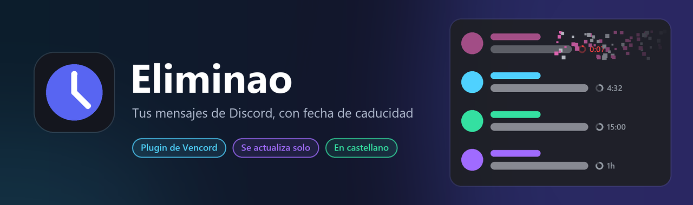

<div align="center">



<br />


**Mensajes temporales para Discord.**
Escribes, eliges cuánto dura y el mensaje se borra solo. El tiempo se cambia al momento, sin salir del chat.

</div>

---

## 🎯 Qué es

Un plugin para [Vencord](https://vencord.dev) que añade un **reloj** a la barra del chat. Lo pulsas,
eliges *30 segundos*, *5 minutos* o *un día*, y todo lo que escribas a partir de ahí se borra
cuando se acabe el tiempo. Al final de cada mensaje temporal aparece una cuenta atrás pequeña y gris,
como el «(editado)» de Discord, para que sepas cuánto le queda.

> 🔒 Solo borra **tus** mensajes, con las mismas peticiones que harías tú a mano y a un ritmo
> que respeta los límites de Discord.

## 📥 Instalación

1. Descarga **[`Eliminao-Instalador.exe`](../../releases/latest/download/Eliminao-Instalador.exe)** desde **[Releases](../../releases)**.
2. Ábrelo. Se instala solo, comprueba que funciona y abre Discord.
3. Busca el ⏱️ en la barra del chat. Ya está.

No hace falta Git, Node ni nada más: solo Discord de escritorio. Si ya lo tienes instalado, el mismo
`.exe` te deja **actualizar, reparar o desinstalar**.

> 🛡️ La primera vez Windows puede decir *«Windows protegió tu PC»*. Es lo que sale con cualquier programa
> sin firma de pago y con pocas descargas: pulsa **Más información → Ejecutar de todas formas**.

## ✨ Qué trae

| | |
|---|---|
| ⏱️ **Reloj en la barra del chat** | Panel con tiempos rápidos, tiempo a medida (`45s`, `2h30m`, `5min`) e interruptor. El reloj se ilumina y muestra el tiempo activo |
| 🏠 **Por chat, por servidor o global** | Cada chat puede tener su tiempo, un servidor entero puede compartir uno, y si no, se usa el global. Gana el más concreto |
| 1️⃣ **Solo el siguiente mensaje** | Se apaga solo después de enviar uno |
| ⏳ **Cuenta atrás discreta** | Al final del texto, con un anillo que se vacía y se pone rojo en los últimos 10 s |
| 🖱️ **Clic derecho y botón al pasar el ratón** | Haz temporal cualquier mensaje tuyo, también los ya enviados. O cambia su tiempo, cancélalo o bórralo ya |
| 🧹 **Mis últimos N mensajes** | Hazlos temporales de golpe desde el panel (hasta 500) |
| ☑️ **Selección múltiple** | Marca varios mensajes y bórralos o hazlos temporales a la vez, con confirmación antes de borrar |
| 📋 **Pendientes** | Lista de lo que se va a borrar en el chat, con su tiempo, para cancelarlo o adelantarlo |
| 💾 **Persistente** | Si cierras Discord, lo que caducó mientras tanto se borra al volver a abrirlo |
| 🔄 **Se actualiza solo** | Cuando sale una versión nueva se descarga sola y te avisa para reiniciar |
| 🛟 **Aguanta las actualizaciones de Discord** | Si Discord cambia algo y la cuenta atrás no puede ir en línea, pasa a mostrarse debajo del mensaje |

## ⌨️ Cómo se usa

| | |
|---|---|
| 🖱️ **Clic en el reloj** | Abre el panel |
| 🖱️ **Clic derecho en el reloj** | Activa o desactiva sin abrir nada |
| ⌨️ **`Alt` + `T`** | Lo mismo con el teclado (se cambia en los ajustes) |
| ✍️ **`!t 30s hola`** | Envía *hola* y lo borra a los 30 s, sin tocar la configuración |

## 🔮 Trucos escondidos

| | |
|---|---|
| 🙅 **`!t off hola`** | Ese mensaje no se borra, aunque el modo temporal esté activo |
| 🕐 **Pasa el ratón por la cuenta atrás** | Te dice a qué hora exacta se borra. **Un clic** y cancelas el borrado |
| 🔵 **El puntito sobre el reloj** | Significa que está en modo *solo el siguiente mensaje* |
| ☑️ **«Todos» en la selección** | Marca de una vez todos tus mensajes cargados en el chat. `Esc` sale del modo selección |
| 🎛️ **Tus propios tiempos rápidos** | En los ajustes: `10s, 1m, 2h30m`… los que quieras, separados por comas |
| 🧭 **Cambiar de pestaña en el panel** | *Este chat* copia el tiempo que tenías para empezar desde ahí; *Global* quita lo propio del chat y del servidor |
| 🔔 **Aviso al borrar** | Actívalo en los ajustes si quieres un toast cada vez que se borra algo |

## ⚙️ Ajustes

En **Ajustes → Vencord → Plugins → Eliminao**:

- **Atajo de teclado:** pulsa el botón y la combinación que quieras. `Retroceso` lo quita.
- **Tiempos rápidos**, **prefijo** (`!t`; vacío lo desactiva), **cuenta atrás**, **actualizaciones automáticas** y **aviso al borrar**.

Los tiempos van de **3 segundos** a **30 días**.

## 🔧 Desarrollo

Para trabajar en el código hace falta [Git](https://git-scm.com) y [Node.js](https://nodejs.org) 22+.

```bat
instalar.bat    :: descarga Vencord, compila con Eliminao y lo instala en Discord (modo desarrollo)
start.bat       :: tests + compila. Luego Ctrl+R en Discord
build-exe.bat   :: genera release\Eliminao-Instalador.exe
publicar.bat    :: publica una versión en GitHub (sube VERSION y el CHANGELOG antes)
deploy.bat      :: deja el plugin en deploy-hosting\ para cualquier Vencord
```

### 🚀 Publicar una versión

1. Sube `VERSION` en `eliminao/utils.ts` y añade la sección `## vX.Y.Z` al [`CHANGELOG.md`](CHANGELOG.md).
2. Haz commit y ejecuta `publicar.bat`.

Compila, genera el instalador y crea el release. Todos los que lo tengan instalado se actualizan solos.

### 🗃️ Estructura

```
eliminao/
  index.tsx        definición del plugin: envío, parches, menús, atajo, actualizaciones
  components.tsx   botón, panel, barra de selección, menús y cuenta atrás
  scheduler.ts     tareas de borrado, cola con límite de peticiones y persistencia
  selection.ts     modo selección múltiple
  settings.ts      ajustes y ámbitos (chat → servidor → global)
  native.ts        actualizador: corre en el proceso principal de Discord
  utils.ts         lógica pura con tests: tiempos, prefijo, atajos, versiones
instalador/        Eliminao-Instalador.exe (C# sobre el .NET que trae Windows)
tests/             tests de utils.ts (se pasan en start.bat)
```

## 🧠 Detalles que conviene saber

- **Cómo sabe qué mensaje borrar.** Al enviar, el plugin aún no conoce el id del mensaje. Discord crea
  primero un mensaje provisional con un `nonce` y después el real con ese mismo `nonce`. Por ahí se emparejan.
- **Un solo temporizador**, apuntando siempre al borrado más próximo, en vez de uno por mensaje.
  `setTimeout` se desborda por encima de ~24,8 días, y eso también está contemplado.
- **Los borrados van en cola, de uno en uno.** Si Discord responde `429` (demasiadas peticiones), espera lo
  que pide y sigue. Si falla la red, lo reintenta sin perder la tarea.
- **La actualización es todo o nada.** Descarga los cuatro archivos, comprueba que el nuevo trae Eliminao
  y solo entonces sustituye. Las instalaciones de desarrollo (con `.git`) no se actualizan, para no pisar tus builds.
- **Tus ajustes y temas de Vencord no se tocan**: siguen en `%APPDATA%\Vencord`.

## ⚠️ Cosas a tener en cuenta

- Solo borra mientras Discord está abierto con el plugin. Lo que caduque con Discord cerrado se borra al abrirlo.
- No funciona en el móvil ni en otros dispositivos sin el plugin.
- Quien esté conectado puede leer el mensaje antes de que se borre, y los bots de registro pueden guardar una copia.
- Los mods de cliente, Vencord incluido, van contra los Términos de Servicio de Discord. Úsalo bajo tu responsabilidad.

## 📜 Licencia

[GPL-3.0-or-later](LICENSE), la misma que Vencord.

<div align="center">

---

hecho con 💙 por [poxi](https://github.com/PoxiiTV)

</div>

---

<div align="center">

# 🇬🇧 English

</div>

## 🎯 What it is

**Temporary messages for Discord.** A [Vencord](https://vencord.dev) plugin that adds a **clock** to the chat
bar. Pick *30 seconds*, *5 minutes* or *a day*, and everything you send from then on deletes itself when time
runs out. A small grey countdown sits at the end of each temporary message, like Discord's «(edited)».

> 🔒 It only deletes **your** messages, with the same requests you'd make by hand and at a pace that
> respects Discord's rate limits.

## 📥 Installation

1. Download **[`Eliminao-Instalador.exe`](../../releases/latest/download/Eliminao-Instalador.exe)** from **[Releases](../../releases)**.
2. Open it. It installs itself, checks that it works and opens Discord.
3. Look for the ⏱️ in the chat bar. Done.

No Git, no Node: just the Discord desktop app. If it's already installed, the same `.exe` lets you
**update, repair or uninstall**.

> 🛡️ Windows may show *«Windows protected your PC»* the first time. That happens with any unsigned app with
> few downloads: click **More info → Run anyway**.

## ✨ Features

Clock button with quick panel · per chat, per server or global timer · next-message-only mode · subtle inline
countdown · right-click and hover button on your messages · make your last N messages temporary · multi-select
to delete or time several at once · pending list · survives restarts · auto-updates · falls back gracefully if
a Discord update breaks the inline countdown.

## ⌨️ How to use it

| | |
|---|---|
| 🖱️ **Click the clock** | Opens the panel |
| 🖱️ **Right-click the clock** | Toggles it without opening anything |
| ⌨️ **`Alt` + `T`** | Same, from the keyboard (configurable in settings) |
| ✍️ **`!t 30s hello`** | Sends *hello* and deletes it after 30 s, without touching your settings |

## 🔮 Hidden gems

| | |
|---|---|
| 🙅 **`!t off hello`** | That message stays, even with temporary mode on |
| 🕐 **Hover the countdown** | Shows the exact deletion time. **One click** cancels it |
| 🔵 **The dot on the clock** | Means *next message only* mode is on |
| ☑️ **«Todos» in selection mode** | Selects all your loaded messages in the chat. `Esc` leaves selection mode |
| 🎛️ **Your own presets** | In settings: `10s, 1m, 2h30m`… any list you like |

## 🔧 Development

Requires [Git](https://git-scm.com) and [Node.js](https://nodejs.org) 22+. Scripts: `instalar.bat` (dev install),
`start.bat` (tests + build, then `Ctrl+R` in Discord), `build-exe.bat` (installer), `publicar.bat` (GitHub release:
bump `VERSION` in `eliminao/utils.ts` and add a `CHANGELOG.md` section first) and `deploy.bat`.

## 🧠 Things worth knowing

- **Matching sent messages:** the plugin doesn't know a message's id when you send it, so it matches the optimistic
  message and the real one through their shared `nonce`.
- **One timer** always pointing at the next deletion, and a **one-by-one queue** that honours `429` responses and
  retries on network errors.
- **All-or-nothing updates:** all files are downloaded and checked before anything is replaced. Dev installs (with
  `.git`) are never auto-updated.
- **Your Vencord settings and themes are untouched**: they stay in `%APPDATA%\Vencord`.

## 📜 License

[GPL-3.0-or-later](LICENSE), same as Vencord.

<div align="center">

---

made with 💙 by [poxi](https://github.com/PoxiiTV)

</div>
